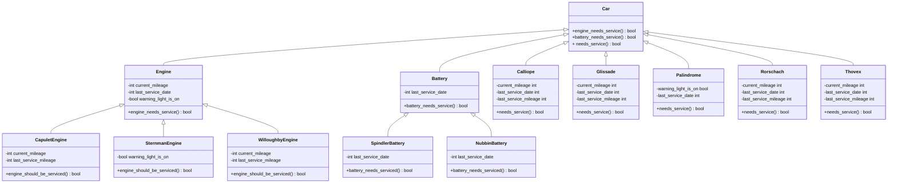
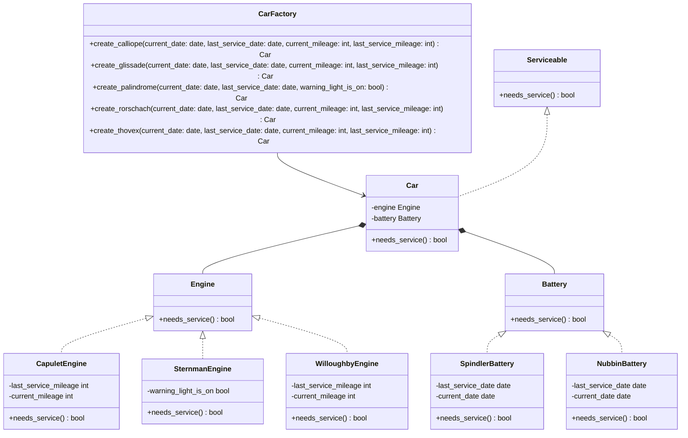

# Dev Notes
## Criteria for car servicing
Whether or not a Lyft rental car should be serviced depends on two factors at the moment:
* The engine; and
* The battery.

Each of the three types of engines has its own criteria for determining when it should be serviced. The same applies to each type of battery.

The current service criteria are as follows:

| Engine/Battery    | Service Criteria                      |
| ----------------- | ------------------------------------- |
| Capulet Engine    | Once every 30,000 miles               |
| Willoughby Engine | Once every 60,000 miles               |
| Sternman Engine   | Only when the warning indicator is on |
| Spindler Battery  | Once every 2 years                    |
| Nubbin Battery    | Once every 4 years                    |

There are five car models in Lyft’s fleet, each with a different engine-battery combination. These are outlined below:

| Car        | Engine            | Battery          |
| ---------- | ----------------- | ---------------- |
| Calliope   | Capulet Engine    | Spindler Battery |
| Glissade   | Willoughby Engine | Spindler Battery |
| Palindrome | Sternman Engine   | Spindler Battery |
| Rorschach  | Willoughby Engine | Nubbin Batte     |
| Thovex     | Capulet Engine    | Nubbin Battery   |

These service criteria will change somewhat frequently in the future, and new car models are bound to be added to the fleet. This is an important consideration throughout the program.

With this in mind, it’s very important that the component is extensible and easy to modify, so new service criteria can be added quickly and efficiently. Just today, you learned that the system must also take tires into account when determining if a car should be serviced in the future.

Tacking this functionality onto the current system would be difficult and messy - instead, you have been instructed to take the time to refactor the codebase prior to making the change. The first step of this process is to draft up a new (clean) system architecture that will allow for the seamless inclusion of the new functionality. Your task is to draft and submit a class diagram that maps out how the system will be reorganized.

## UML Class Diagrams
### My initial attempt

### The solution from Forage

